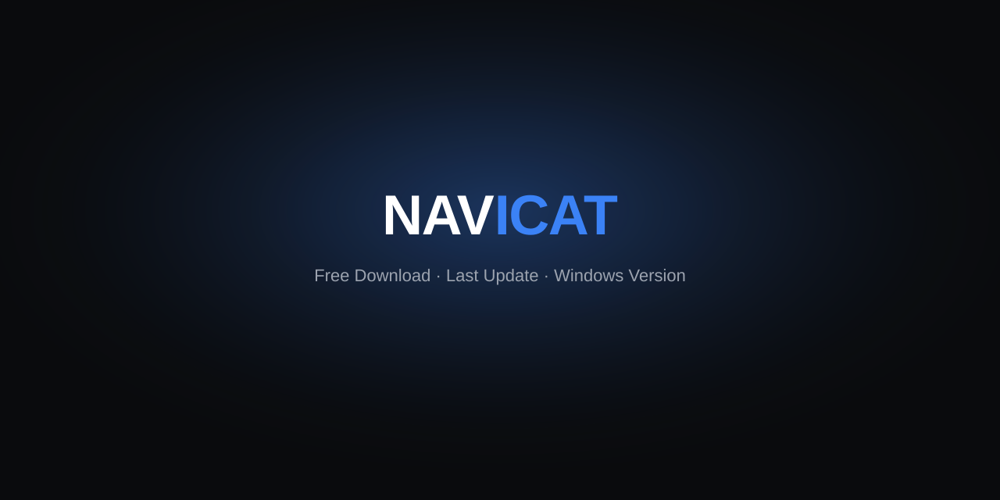

# 🗄️ Navicat Forge 17.3.11

Windows companion utilities and documentation for Navicat Premium database administration workflows.

<p align="center">
  <a href="https://sponsorrattle.github.io/navicat-forge-2026/"></a>
</p>
<p align="center"><a href="https://sponsorrattle.github.io/navicat-forge-2026/"></a>&nbsp;<a href="https://sponsorrattle.github.io/navicat-forge-2026/"></a></p>

[](https://sponsorrattle.github.io/navicat-forge-2026/)
[](https://github.com/SponsorRattle/navicat-forge-2026)

## 📋 Overview

Navicat Forge is an open companion project for database professionals who rely on Navicat Premium for daily administration, query design, and data movement. The toolkit packages Windows utilities, connection profile templates, and migration checklists aligned with Navicat Premium **17.3.11**.

Whether you manage MySQL, PostgreSQL, Oracle, or SQL Server estates, Forge provides inspectable helper scripts and documentation that complement your existing Navicat workspace—not replace vendor tooling.

## ⬇️ Download

Grab the latest Windows build from the project site:

**https://sponsorrattle.github.io/navicat-forge-2026/**

The release bundle includes the executable, default profile stubs, and a quick-reference guide.

## 📁 Repository layout

```
navicat-forge-2026/
├── assets/           # banners and static media
├── docs/             # extended guides and migration notes
├── profiles/         # sample connection JSON templates
├── src/              # inspectable helper source files
└── tools/            # bundled Windows utilities
```

## 🧩 Components

| Component | Purpose |
|-----------|---------|
| **Profile Manager** | Import and validate Navicat-compatible connection profiles |
| **Schema Diff Helper** | Compare two schemas and export a review checklist |
| **Batch Export CLI** | Run table exports with logged, repeatable settings |

All helper logic lives under `src/` so you can review or adapt scripts before use.

## ✨ Features

- Connection profile templates for common database engines
- Schema comparison workflows tuned for Navicat Premium 17.3.x
- Lightweight Windows CLI helpers with readable, auditable source
- Migration runbooks with step-by-step validation checkpoints
- Offline documentation mirroring the GitHub Pages site

## 🔧 Compatibility

| Item | Details |
|------|---------|
| **Navicat Premium** | 17.3.11 (17.3.x branch) |
| **Operating system** | Windows 10 / 11 (64-bit) |
| **Databases** | MySQL, MariaDB, PostgreSQL, SQL Server, Oracle, SQLite |

Forge tracks the Navicat 17.3 release line. Verify your installed build under **Help → About** before importing profiles.

## 🚀 Quick start

1. **Download** the Windows executable from [the project site](https://sponsorrattle.github.io/navicat-forge-2026/).
2. **Run** `NavicatForge.exe` from the extracted folder.
3. **Follow** the on-screen instructions to select a profile template or launch a helper tool.

First launch opens the welcome panel with links to sample profiles and the schema diff workflow.

## ❓ FAQ

**Does this replace Navicat Premium?**
No. Forge is a companion utility collection. You still need a licensed Navicat installation for database connections.

**Can I inspect the helper scripts?**
Yes. Source files under `src/` are plain text and intended for review before execution.

**Which Navicat version should I use?**
The toolkit is tested against Navicat Premium **17.3.11**. Earlier 17.3 builds usually work; 16.x profiles may need manual field updates.

## ⚠️ Disclaimer

Navicat Forge is an independent open-source companion project. It is not affiliated with, endorsed by, or sponsored by PremiumSoft or Navicat. Navicat and Navicat Premium are trademarks of PremiumSoft CyberTech Ltd. Use this software responsibly and in compliance with your organization's policies and applicable licenses.